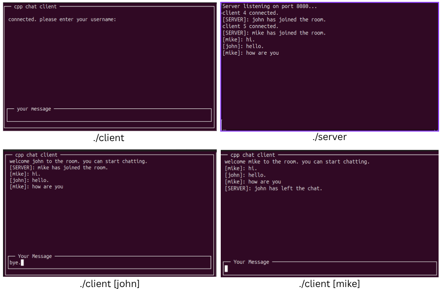

# **C++ Multi-Threaded Chat Service**

A high-performance, multi-threaded, and modular chat server and client application written in C++ from scratch. This project demonstrates core concepts in systems programming, concurrency, and network architecture.

## **🚀 Core Features**

### **Implemented**

* **Multi-Threaded Server:** Utilizes a thread-per-client model to handle multiple concurrent users.  
* **Thread-Safe:** Manages shared server state (like the user list) using `std::mutex` to prevent race conditions.  
* **Modular Architecture:** The entire application (both server and client) is decoupled into a **Network Layer** and an **Application/UI Layer**. This separation of concerns allows for easy maintenance and upgrades (e.g., swapping the UI or networking engine).  
* **Event-Driven Design:** The Network and Application layers communicate using `std::function` callbacks, a clean, event-driven pattern.  
* **Rich TUI Client:** The client is a full Text-based User Interface (TUI) built with the `ncurses` library, featuring separate windows for chat history and user input.  
* **Application Protocol:** Implements a simple text-based protocol with:  
  * User registration (usernames).  
  * Public message broadcasting.  
  * Server commands (e.g., `/users`).

### **🛠️ Core Technologies**

* **C++17:** Used for all server and client logic.  
* **POSIX Sockets API:** For all low-level TCP networking.  
* **`<thread>` & `<mutex>`:** For concurrency and thread-safety.  
* **`ncurses`:** For the rich terminal user interface.  
* **`Makefile`:** For efficient and professional project compilation.

## **📈 Planned Features**

This project is being upgraded to a high-performance, asynchronous model.

* [ ] **`epoll` Integration:** Replace the thread-per-client model with a non-blocking, event-driven I/O model using `epoll` to handle 10,000+ connections. 
* [ ] **Security:** Implement TLS/SSL encryption using **OpenSSL** to secure all network traffic. 
* [ ] **Persistence:** Integrate **SQLite** for user account registration/login and persistent message history.

## **🏗️ How to Build**

**Prerequisites:**

* `g++` (C++17 compatible) 
* `make` 
* `libncurses-dev` (run `sudo apt install libncurses-dev` on Ubuntu/Debian)

From the project's root directory, simply run `make`:
```bash
make
```

This will compile and create two executables: `server` and `client`.

To clean all built files:

```bash
make clean
```

## **🏃 How to Run**

**Start the Server:** Run the `server` executable from the root directory.
```bash
./server
```
1. The server will start listening on port 8080.

**Start the Client:** Open a new terminal and run the `client` executable.
```bash
./client
```

2. The `ncurses` UI will launch, and you can connect multiple clients.



## **🏛️ Project Architecture**

This project is built on a clean, decoupled two-layer architecture.

### **Server-Side**

* **`NetworkServer`:** The "engine." This class handles all low-level networking (sockets, `accept()`, `read()`, `write()`, and threading). It knows nothing about chat rooms or usernames. It reports events (like `onDataReceived`) via callbacks.  
* **`ChatApplication`:** The "brain." This class holds all the business logic (the user map, command parsing). It knows nothing about sockets. It listens for events from the `NetworkServer` and sends commands back.  
* **`main.cpp`:** The "glue." It simply creates the `NetworkServer` and `ChatApplication` objects and connects them.

### **Client-Side**

* **`NetworkClient`:** The "engine." Handles the connection, the network read thread, and `send()` calls. It reports network events via callbacks.  
* **`TerminalUI` (`ncurses`):** The "dashboard." This class handles all `ncurses` initialization, window drawing, and user input. It calls `client.send()` on user commands and displays messages it receives from the `onDataReceived` callback.

